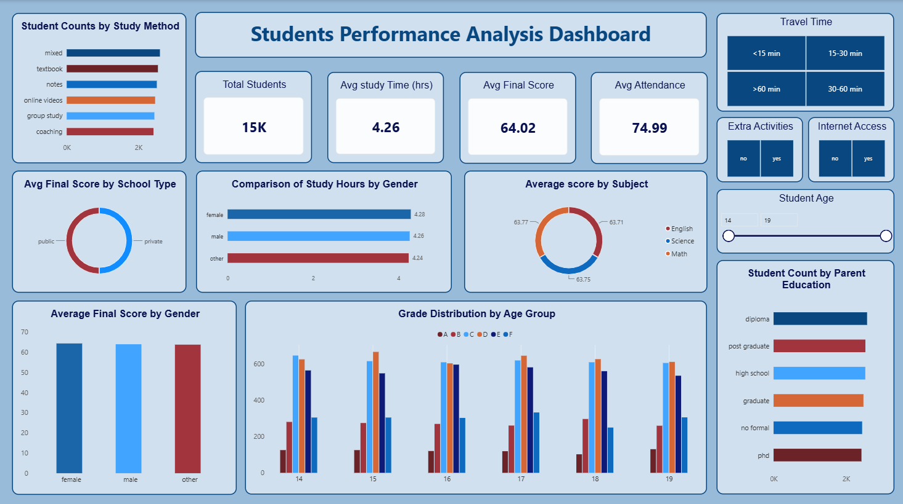

# Student Performance Analysis

A data analytics project analyzing student academic performance. Covering data cleaning, SQL analysis, and dashboard visualization to identify the key factors behind academic results.

## Overview

This project cleans a raw student performance dataset, analyzes trends across subjects, demographics, and study habits using SQL, and visualizes the findings in an interactive Power BI dashboard. Alongside the dashboard, a detailed Insights Report documents the key findings and provides actionable recommendations based on the analysis.

- **Before Cleaning:** 25,000 records
- **After Cleaning:** 15,000 records, 16 columns
- **Average Final Score:** 64.02%
- **Average Attendance:** 74.99%

## Project Structure

```
├── Data/
│   ├── Student_Performance_Raw.csv       # Original, uncleaned dataset
│   └── Student_Performance_Cleaned.csv   # Final cleaned dataset
├── Docs/
│   ├── DataCleaning.md                   # Step-by-step record of cleaning decisions
│   ├── DataDictionary.md                 # Column definitions and descriptions
│   └── InsightsReport.md                 # Full analysis, findings, and recommendations
├── Assets/
│   ├── Student_Performance_Analysis_Dashboard.pbix   # Power BI dashboard file
│   └── Student_Performance_Analysis_Dashboard.png    # Dashboard screenshot
├── queries.sql                           # SQL queries used for cleaning and analysis
└── README.md
```

## Data Cleaning

The raw dataset had duplicate records, missing primary key constraints, and inconsistent values. All cleaning steps are documented in [Docs/DataCleaning.md](Docs/DataCleaning.md). The SQL queries used are in [queries.sql](queries.sql).

## Data Dictionary

Full column-by-column definitions for the cleaned dataset are in [Docs/DataDictionary.md](Docs/DataDictionary.md).

## Insights

The full analysis — covering study methods, extracurricular activity, travel time, parental education, and school type — along with actionable recommendations for school administrators, is in [Docs/InsightsReport.md](Docs/InsightsReport.md).

**Key findings:**
- Independent, self-directed study (online videos) outperforms group study by a wide margin
- Students with no internet access and no extracurricular activities see the sharpest drop in performance
- Background factors — school type, travel time, parental education — have little to no impact on academic outcomes

## Dashboard

The Power BI dashboard visualizes student performance across subjects, demographics, and study habits.



**Views included:**
- Average Final Score by School Type, Gender, and Subject
- Grade Distribution by Age Group
- Student Counts by Study Method and Parent Education
- Comparison of Study Hours by Gender
- Filters for Travel Time, Extra Activities, Internet Access, and Student Age

The interactive dashboard file is available at `Assets/Student_Performance_Analysis_Dashboard.pbix` (requires Power BI Desktop to open).

## Tools Used

- **MS SQL Server** — data cleaning, validation, and aggregation
- **Power BI** — dashboard visualization